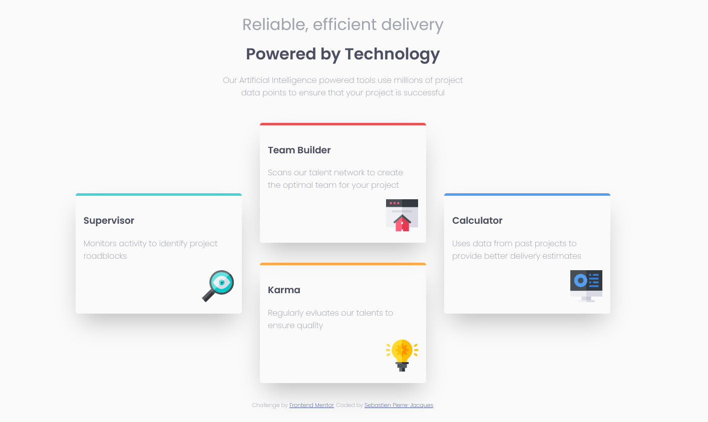

# Frontend Mentor - Four card feature section solution

This is a solution to the [Four card feature section challenge on Frontend Mentor](https://www.frontendmentor.io/challenges/four-card-feature-section-weK1eFYK). Frontend Mentor challenges help you improve your coding skills by building realistic projects. 

## Table of contents

- [Overview](#overview)
  - [The challenge](#the-challenge)
  - [Screenshot](#screenshot)
  - [Links](#links)
- [My process](#my-process)
  - [Built with](#built-with)
  - [What I learned](#what-i-learned)
  - [Continued development](#continued-development)
- [Author](#author)

## Overview

### The challenge

Users should be able to:

- View the optimal layout for the site depending on their device's screen size

### Screenshot

### Links

- Solution URL: [Frontend Mentor Solution Page](https://www.frontendmentor.io/solutions/four-card-feature-section-with-html-and-css-z4wdFjNOy)
- Live Site URL: [Github Pages](https://sebastienpj.github.io/frontEndMentor-fourCardFeatureSection/)

## My process

### Built with

- HTML5
- CSS

### What I learned

I wanted to push my understanding of manipulating elements without using any frameworks. Turns out, as it always does, that I have much to learn. The experience has thought me greatly as I am not able to through a quick layout of the elements onto the screen. I will continue to push without any frameworks. 

### Continued development

- Using Semantic HTML
- Having a more conscise and modular CSS
- Refactoring more often

## Author

- Website - [Sebastien Pierre-Jacques](https://www.linkedin.com/in/sebastien-pierre-jacques/)
- Frontend Mentor - [@SebastienPJ](https://www.frontendmentor.io/profile/SebastienPJ)
- Twitter - [@sebastien_pj](https://twitter.com/sebastien_pj)
